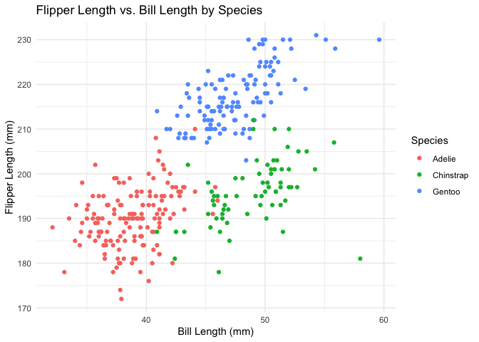

p8105_hw1_zz3166
================
2024-09-21

Problem 1

``` r
data("penguins", package = "palmerpenguins")
str(penguins)
```

    ## tibble [344 × 8] (S3: tbl_df/tbl/data.frame)
    ##  $ species          : Factor w/ 3 levels "Adelie","Chinstrap",..: 1 1 1 1 1 1 1 1 1 1 ...
    ##  $ island           : Factor w/ 3 levels "Biscoe","Dream",..: 3 3 3 3 3 3 3 3 3 3 ...
    ##  $ bill_length_mm   : num [1:344] 39.1 39.5 40.3 NA 36.7 39.3 38.9 39.2 34.1 42 ...
    ##  $ bill_depth_mm    : num [1:344] 18.7 17.4 18 NA 19.3 20.6 17.8 19.6 18.1 20.2 ...
    ##  $ flipper_length_mm: int [1:344] 181 186 195 NA 193 190 181 195 193 190 ...
    ##  $ body_mass_g      : int [1:344] 3750 3800 3250 NA 3450 3650 3625 4675 3475 4250 ...
    ##  $ sex              : Factor w/ 2 levels "female","male": 2 1 1 NA 1 2 1 2 NA NA ...
    ##  $ year             : int [1:344] 2007 2007 2007 2007 2007 2007 2007 2007 2007 2007 ...

``` r
summary(penguins)
```

    ##       species          island    bill_length_mm  bill_depth_mm  
    ##  Adelie   :152   Biscoe   :168   Min.   :32.10   Min.   :13.10  
    ##  Chinstrap: 68   Dream    :124   1st Qu.:39.23   1st Qu.:15.60  
    ##  Gentoo   :124   Torgersen: 52   Median :44.45   Median :17.30  
    ##                                  Mean   :43.92   Mean   :17.15  
    ##                                  3rd Qu.:48.50   3rd Qu.:18.70  
    ##                                  Max.   :59.60   Max.   :21.50  
    ##                                  NA's   :2       NA's   :2      
    ##  flipper_length_mm  body_mass_g       sex           year     
    ##  Min.   :172.0     Min.   :2700   female:165   Min.   :2007  
    ##  1st Qu.:190.0     1st Qu.:3550   male  :168   1st Qu.:2007  
    ##  Median :197.0     Median :4050   NA's  : 11   Median :2008  
    ##  Mean   :200.9     Mean   :4202                Mean   :2008  
    ##  3rd Qu.:213.0     3rd Qu.:4750                3rd Qu.:2009  
    ##  Max.   :231.0     Max.   :6300                Max.   :2009  
    ##  NA's   :2         NA's   :2

Penguins Dataset Overview

The `penguins` dataset contains information about penguin species
collected from Palmer Station, Antarctica. Important variables in this
dataset include:

- **Species**: Species of penguin (`Adelie`, `Chinstrap`, `Gentoo`)
- **island**: Island name (`Biscoe`, `Dream`, `Torgersen`)
- **bill_length_mm**: Length of the penguin’s bill in millimeters
- **bill_depth_mm**: Depth of the penguin’s bill in millimeters
- **flipper_length_mm**: Length of the penguin’s flippers in millimeters
- **body_mass_g**: Body mass in grams
- **sex**: Sex of the penguin (`male`, `female`)
- **year**: Time when the data recorded

The dataset contains 344 rows and 8 columns. The mean flipper length
across all penguins is 200.92 mm.

``` r
library(ggplot2)

ggplot(data = penguins, aes(x = bill_length_mm, y = flipper_length_mm, color = species)) +
  geom_point() +
  labs(title = "Flipper Length vs. Bill Length by Species",
       x = "Bill Length (mm)",
       y = "Flipper Length (mm)",
       color = "Species") +
  theme_minimal()
```

    ## Warning: Removed 2 rows containing missing values or values outside the scale range
    ## (`geom_point()`).

<!-- -->

``` r
ggsave("penguin_scatterplot.png")
```

    ## Saving 7 x 5 in image

    ## Warning: Removed 2 rows containing missing values or values outside the scale range
    ## (`geom_point()`).

Problem 2

Creating the Data Frame

``` r
set.seed(123)

random_sample <- rnorm(10)

# Create logical vector: TRUE if numeric_var > 0, else FALSE
logical_vector <- random_sample > 0

# Create character vector
character_vector <- c("Apple", "Banana", "Cherry", "Date", "Elderberry",
                      "Fig", "Grape", "Honeydew", "Ita Palm", "Jackfruit")

# Create factor vector with 3 levels
factor_levels <- c("Low", "Medium", "High")
factor_vector <- factor(rep(factor_levels, length.out = 10))

my_data <- data.frame(
  random_sample,
  logical_vector,
  character_vector,
  factor_vector
)
```

``` r
library(tidyverse)
```

    ## ── Attaching core tidyverse packages ──────────────────────── tidyverse 2.0.0 ──
    ## ✔ dplyr     1.1.4     ✔ readr     2.1.5
    ## ✔ forcats   1.0.0     ✔ stringr   1.5.1
    ## ✔ lubridate 1.9.3     ✔ tibble    3.2.1
    ## ✔ purrr     1.0.2     ✔ tidyr     1.3.1
    ## ── Conflicts ────────────────────────────────────────── tidyverse_conflicts() ──
    ## ✖ dplyr::filter() masks stats::filter()
    ## ✖ dplyr::lag()    masks stats::lag()
    ## ℹ Use the conflicted package (<http://conflicted.r-lib.org/>) to force all conflicts to become errors

``` r
# Mean of the numeric variable
mean_random_sample <- mean(pull(my_data, random_sample))
mean_random_sample
```

    ## [1] 0.07462564

**Success**.The mean of `random_sample` is successfully calculated
because it is a numeric factor

``` r
# Mean of the logical vector
mean_logical_vector <- mean(pull(my_data, logical_vector))
mean_logical_vector
```

    ## [1] 0.5

**Success**.The mean of `logical_vector` is successfully calculated. In
R, logical values are coerced to numeric values (`TRUE` becomes 1,
`FALSE` becomes 0), so the mean represents the proportion of `TRUE`
values.

``` r
# Mean of the character vector
mean_character_vector <- mean(pull(my_data, character_vector))
```

    ## Warning in mean.default(pull(my_data, character_vector)): argument is not
    ## numeric or logical: returning NA

**Error**. Computing the mean of `character_vector` fails because
character strings cannot be averaged. R cannot coerce character data to
numeric values in this context.

``` r
# Mean of the factor vector
mean_factor_vector <- mean(pull(my_data, factor_vector))
```

    ## Warning in mean.default(pull(my_data, factor_vector)): argument is not numeric
    ## or logical: returning NA

**Error**. Computing the mean of `factor_vector` fails. Although factors
are internally stored as integers, the `mean()` function does not
directly compute the mean of factor levels because factors are
considered categorical data.

Applying `as.numeric()` to Variables

``` r
# Apply as.numeric to the logical vector
numeric_logical_vector <- as.numeric(my_data$logical_vector)

# Apply as.numeric to the character vector
numeric_character_vector <- as.numeric(my_data$character_vector)
```

    ## Warning: NAs introduced by coercion

``` r
# Apply as.numeric to the factor vector
numeric_factor_vector <- as.numeric(my_data$factor_vector)
```

**Logical Vector**: `TRUE` values are converted to `1`, and `FALSE`
values are converted to `0`. Logical values in R are stored as integers
under the hood, where `True` equals `1` and `FALSE` equals `0`. After
conversion, computing the mean yields the proportion of `TRUE` values in
the vector. This explains why taking the mean of a logical vector works;
the logical values are effectively numeric.

**Character Vector**: If the character vector contains numbers in string
form (e.g., `"1"`, `"2"`), `as.numeric()` converts them to numeric
values.If it contains non-numeric strings, `as.numeric()` will produce
`NA` and a warning.Character vectors cannot be averaged because they are
non-numeric, and coercion may not result in valid numbers.

**Factor Vector**: Factors are internally stored as integers
corresponding to their levels. `as.numeric()` on a factor returns these
underlying integer codes. This may not represent meaningful numeric
data. The mean of the factor vector does not work directly because
factors are categorical.Converting factors to numeric gives the
underlying integer codes, which may not be meaningful.

**Conclusion**: Understanding how R handles different data types and
coercion helps explain why certain operations succeed or fail. This
emphasizes the importance of ensuring variables are in the correct
format for analysis.
